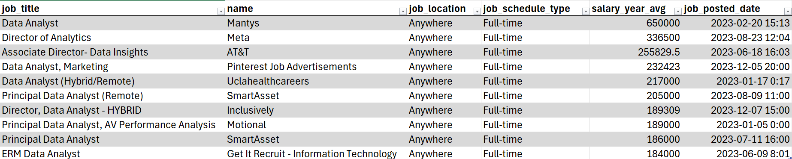
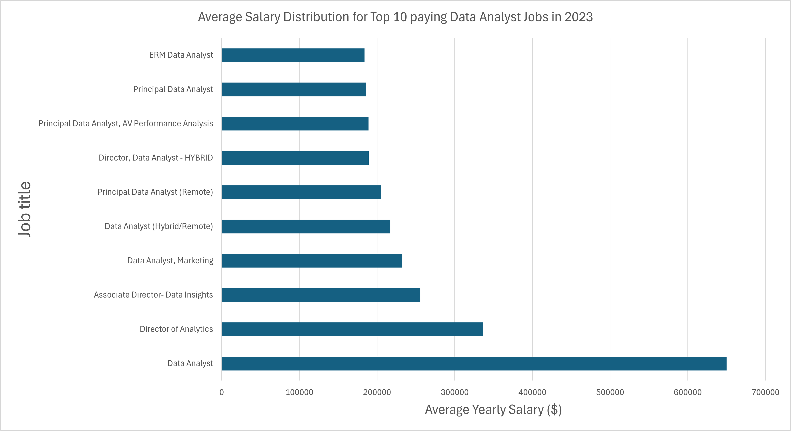
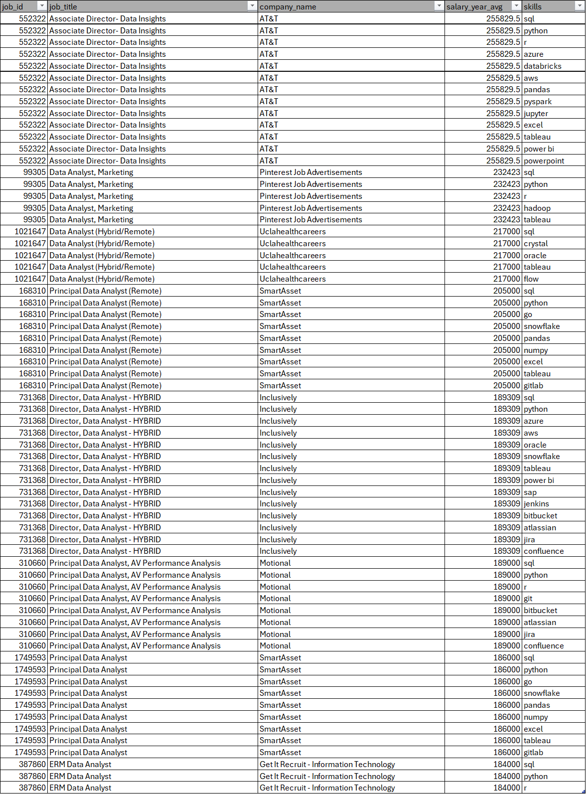
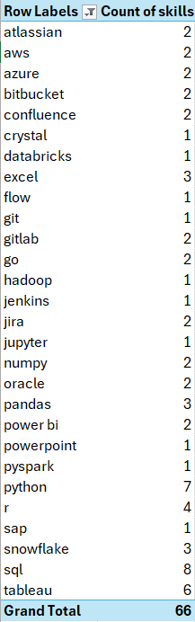
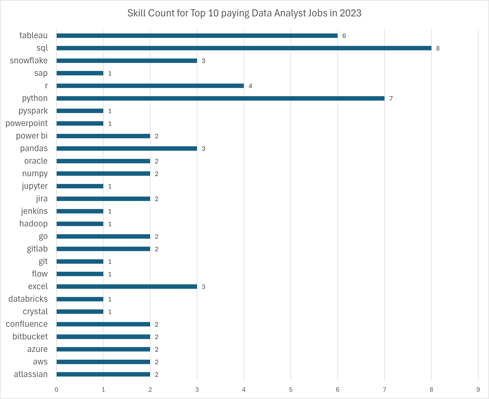
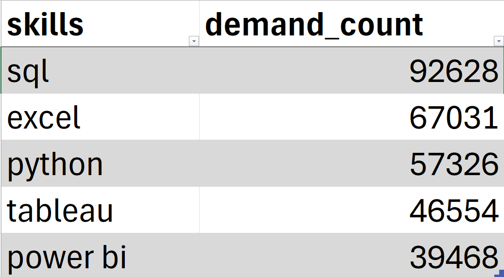
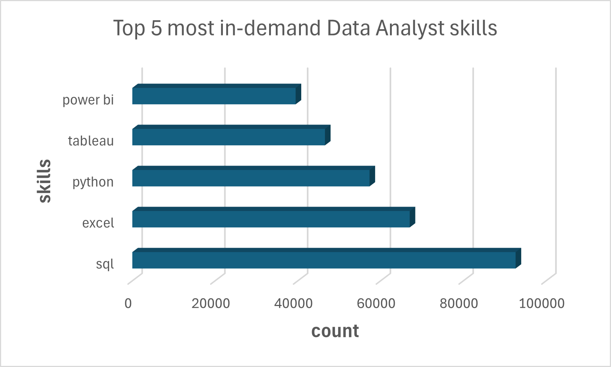
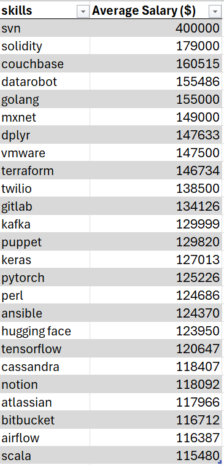
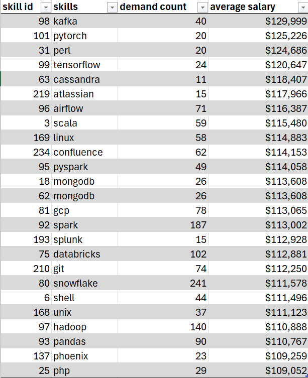

# Introduction
Examing the current job market in tech. Here we are focusing on data analyst roles and trying to figure out the top-paying jobs, in-demand skills and the correlation between skills that are in-demand and that are also high-paying.

Looking for SQL queries? Check them out here: [project_sql folder](/project_sql/)

# Background
Wanting to better navigate the current data analyst job market, this projects goal is to identify top-paying in-demand skills so that job seekers can learn those skills in hopes of finding employment.

Data is derived from [Luke Barousse](https://lukebarousse.com/sql). It contains information related to job titles, locations, salaries, and important skills.

### The questions I wanted to address via SQL were:
1. What are the top paying data analyst jobs?
2. What skills are required for those top paying data analyst jobs?
3. What are the most in-demand skills for data analysts?
4. Which skills are associated with higher salaries?
5. What are the most optimal skills to learn (a.k.a it's in high demand and a high-paying skill)?

# Tools I used
For this project, I utlized several key tools:
- **SQL:** Querying the database to uncover crucial insights
- **Excel:** To make visualizations of our data
- **PostgreSQL:** Database management system that was chosen due to its performance and scalability 
- **Visual Studio Code:** text editor used to manage the database and executing SQL queries
- **Git & Github:** Useful for providing version control as well as sharing analysis gathered from SQL scripts, allowing for collaboration and tracking of project

# The Analysis
The queries for the project looked at specific aspects of the data analyst job market with a focus on salary and skills. Here is the approach for each question.

### 1. Top Paying Data Analyst Jobs
The following query showcases the highest-paying jobs within the field based on average salary and job location (i.e being remote)

```sql
SELECT
    job_id,
    job_title,
    company_dim.name,
    job_location,
    job_schedule_type,
    salary_year_avg,
    job_posted_date
FROM
    job_postings_fact
LEFT JOIN
    company_dim ON company_dim.company_id = job_postings_fact.company_id
WHERE
    job_title_short = 'Data Analyst' AND
    job_location = 'Anywhere' AND
    NOT salary_year_avg IS NULL
ORDER BY
    salary_year_avg DESC
LIMIT 10
```

*resulting table from the above executed SQL query. Showing information related to job title, company name, location, schedule, salary and posted date.*

The following provides a breakdown of the top paying data analyst jobs in 2023:
- **Varied Salary Range:** Top 10 jobs had salaries ranging from $184,000 to $650,000, which indicates the potential for a significant salary as a data analyst
- **Diverse Employers:** Companies offering those salaries included SmartAsset, Meta, and AT&T, showing a broad interest across industries
- **Job Title Variety:** There is a diversity of different job titles from Data Analyst to Director of Analytics, which shows many different roles and specializations within the field of data analytics 


*Bar Graph illustrates the top 10 highest paying data analyst roles, generated via excel from the SQL query result table above*

### 2. Skills for Top Paying Jobs
We want to examine what skills are needed for said high-paying jobs. In order to find out, I joined the job postings table with the skills data table, better understanding what employers value for such high paying roles.

```sql
WITH top_paying_jobs AS(
    SELECT
        job_postings_fact.job_id,
        job_title,
        name AS company_name,
        salary_year_avg
    FROM
        job_postings_fact
    LEFT JOIN
        company_dim ON company_dim.company_id = job_postings_fact.company_id
    WHERE
        job_title_short = 'Data Analyst' AND
        job_location = 'Anywhere' AND
        NOT salary_year_avg IS NULL
    ORDER BY
        salary_year_avg DESC
    LIMIT 10
)

SELECT 
    top_paying_jobs.*,
    skills
FROM 
    top_paying_jobs
INNER JOIN
    skills_job_dim ON skills_job_dim.job_id = top_paying_jobs.job_id
INNER JOIN
    skills_dim ON skills_dim.skill_id = skills_job_dim.skill_id
ORDER BY
    salary_year_avg DESC
```

*resulting table from the above executed SQL query. Showing information related to job id, title, company name, salary, and skills.*

A breakdown of our results regarding the most in-demand skills for the top 10 highest paying data analyst jobs in 2023:

- **SQL** is the most in demand with a count of 8
- **Python** is a close second with a count of 7
- **Tableau** is third with a count of 6
- Other high in demand skills include **R, Snowflake, Pandas, and Excel**

 

*A pivot table created in Excel from the results table above showing the skills and their associated count*

 
*A graph that visualizes skills count for the top 10 highest paying Data Analyst jobs, generated via Excel from the pivot table above.*

### 3. In-Demand Skills for Data Analysts
The following query helped to filter for top skills that were frequently requested by Data Analyst job postings.

```sql
SELECT
    skills,
    COUNT(skills_job_dim.job_id) AS demand_count
FROM 
   job_postings_fact
INNER JOIN
    skills_job_dim ON skills_job_dim.job_id = job_postings_fact.job_id
INNER JOIN
    skills_dim ON skills_dim.skill_id = skills_job_dim.skill_id
WHERE
    job_title_short = 'Data Analyst'
GROUP BY
    skills
ORDER BY
    demand_count DESC
LIMIT 5
```
A brekadown of skills most in-demand for Data Analyst roles in 2023:
- **SQL and Excel** are the most fundamental skills to learn, highlighting the need for people to be able to process and organize data.
- **Python, Tableau and PowerBI** also cracked the list, highlighting the importance of knowing programming as well as data visualization tools for data storytelling.


*Table shows top 5 skills mentioned in Data Analyst job postings*


*Graph illustrating the top 5 most in-demnad Data Analyst skills*

### 4. Skills Based on Salary
Looked at different skills and their associated average salaries to determine what skills ultimately led to higher compensation

```sql
SELECT
    skills,
    ROUND(AVG(salary_year_avg), 0) AS avg_salary
FROM 
   job_postings_fact
INNER JOIN
    skills_job_dim ON skills_job_dim.job_id = job_postings_fact.job_id
INNER JOIN
    skills_dim ON skills_dim.skill_id = skills_job_dim.skill_id
WHERE
    job_title_short = 'Data Analyst' AND
    salary_year_avg IS NOT NULL
GROUP BY
    skills
ORDER BY
    avg_salary DESC
LIMIT 25
```


*Table showing the top highest paying skills for Data Analysts*

Here is a breakdown of the results for the top paying Data Analyst skills:
- **Big Data and Machine Learning skills:** Analyst who can acquire skills with big data technologies (such as Cassandra, and CouchBase), as well as machine learning tools (like TensorFlow and pytorch), could potentially earn a higher salary. This tells us that industries value individuals who are highly capable of processing data as well as performing predicitive modeling.
- **Software development and Deployment skills:** Learning tools related to software development and deployment such as GitLab, BitBucket, and Airflow tell us that skills involved in automation and managing data pipelines are deemed lucrative.
- **cloud computing skills:** Being able to navigate through cloud and data engineering tools such as google cloud, terraform and kafka illustrates the rise in cloud-based analytics environments, suggesting that learning the cloud can lead to more high-paying opportunities.

### 5. Most Optimal Skills to Learn
Here we have combined our insights from the previous 2 SQL queries regarding in-demand skills and salary to come up with a new query that could show us skills that are not just in demand but are also high paying as well. Thus we want to focus on the most optimal skills that data analyst need to acquire in order to be both more employable and better compensated

```sql
SELECT 
    skills_dim.skill_id,
    skills_dim.skills,
    COUNT(skills_job_dim.job_id) AS demand_count,
    ROUND(AVG(job_postings_fact.salary_year_avg), 0) AS avg_salary
FROM
    job_postings_fact
INNER JOIN
    skills_job_dim ON skills_job_dim.job_id = job_postings_fact.job_id
INNER JOIN
    skills_dim ON skills_dim.skill_id = skills_job_dim.skill_id
WHERE
    job_title_short = 'Data Analyst'
    AND salary_year_avg IS NOT NULL
GROUP BY
    skills_dim.skill_id
HAVING
    COUNT(skills_job_dim.job_id) > 10
ORDER BY
    avg_salary DESC,
    demand_count DESC 
LIMIT 25;
```

*Table which is sorted by salary illustrates the most optimal skills for Data Analysts*

The following provides a breakdown of the results that were uncovered
- The results matched more with skills that provided a higher salary (query/heading #4) as again **Big Data and Machine Learning skills**, **Software development and deployment skills** along with **cloud computing skills** are all in-demand and high-paying.
- In addition, **programming knowledge** whether its php (a programming language) or a python library (such as pandas), can help one set them apart from the rest of the competition as it shows more advanced data analysis capabilites
- **Database technologies** specifically NoSQL databases (Cassandra, MongoDB) are also optimal skills to acquire, which reflects the need for individuals to be able to sort, manage, retrieve and go through large datasets with different software applications
- **operating systems:** The use and operation of different operating systems (linux, UNIX) are also valuable skills to have, showcasing that different companies may use different OS environemnts due to their different functionality features. 
- Ironically, the **more-indemand skills but not necessarily the highest-paying skills (query/heading #3) did not make the list**. These skills included *SQL, python, Excel, tableau and PowerBI*. This could be due to having the aggregate COUNT function set to greater than 10 in the HAVING clause. Had we set the number higher (perhaps at least 25), they would probably have appeared in our table results. This could be due to the fact that those skills are deemed essential and so even though there are high-paying jobs that require those skills (as seen in query/heading #2), there are also jobs that want you to have those skills but aren't as high-paying.

# What I learned
Throughout this project, I have further expanded my skillset in both Excel and SQL.
- Learned how to create **pivot tables and data visualizations** via Excel for in depth analysis
- Creating SQL queries that utlized **subqueries, common table expressions (CTE's), and data aggregation functions** such as COUNT, AVERAGE and ROUND
- Further developed my **analytical thinking skills** by being able to come up with relevant questions that arise from the given dataset(s) and crafting SQL queries, along with creating visualizations in order to provide insights into those questions.

# Conclusions

### Insights
1. Data Analyst jobs offers a wide range of salaries with a bunch of them offering six-figures, the highest being at $650,000
2. **SQL and Excel** are the most in-demand skills for Data Analysts along with **python, tableau and PowerBI**. This suggests that these skills are the minimal requirement for job seekers trying to enter the field of analytics and that they should priortize those skills.
3. Skills such as **SVN and solidity** are skills that on average offer **higher salaries** which showcases that analyst with niche expertise can command a higher salary
4. Having skills outside of typical analyst work whether it's in **programming, databases, operating systems, machine learning and big data technologies** can open new doors to more interesting and better paying Data Analyst jobs

### Closing Thoughts
During this project I had explored datasets that looked at the overall job market. I focused on Data Analyst jobs and attempted to answer questions that related to salary expectations as well as skills needed for the job. The findings from this project can help guide current and future analysts into determining what skills they should learn in order to find employment and/or higher salary. Individuals looking to break into the field should focus on **SQL, python, tableau, excel and powerBI** while more experienced analysts can try to become either an expert in a skill that's niche or expand their tech/IT skillset in order to find better opportunities. This analysis highlights how crucial upskilling is as learning is a continuous process.  